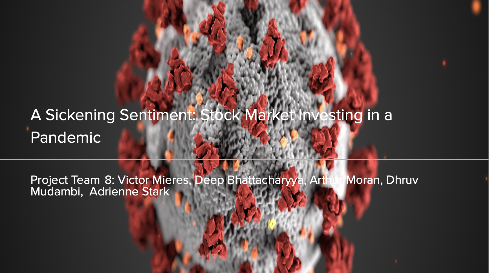
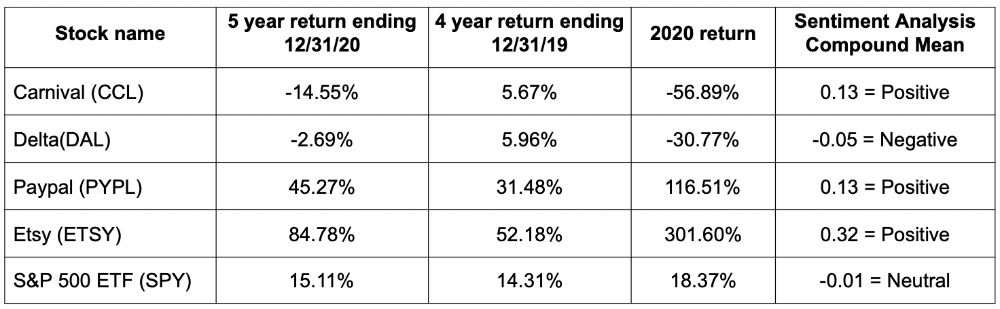
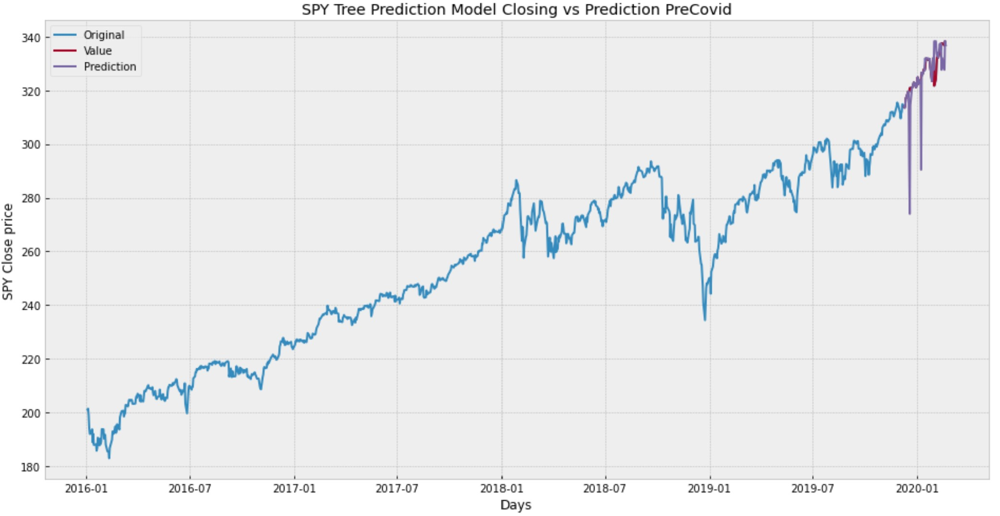
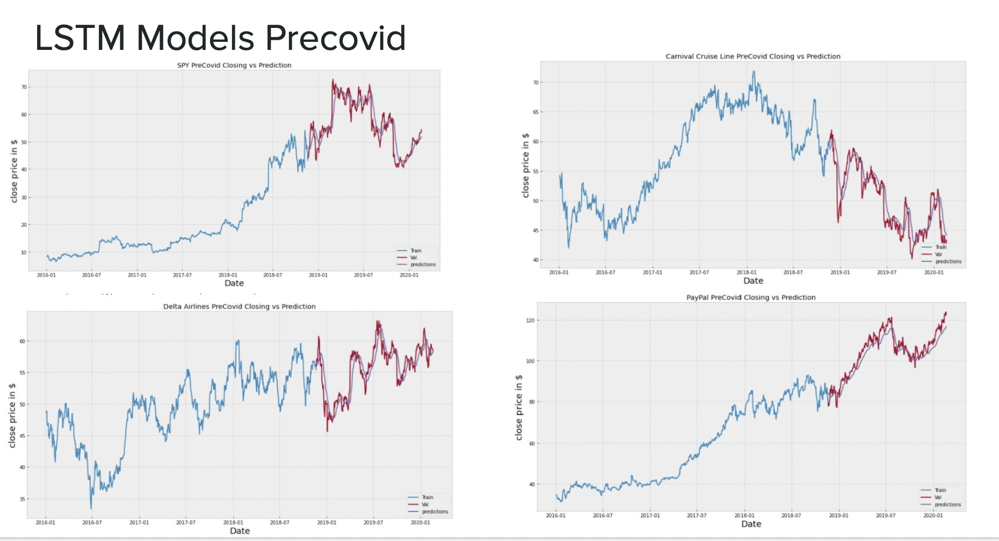
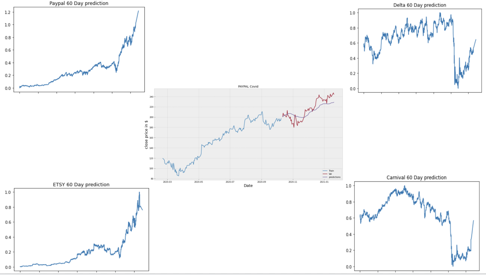
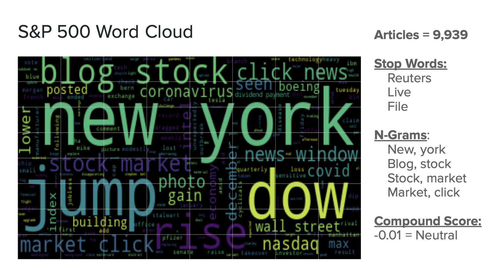

# **A Sickening Sentiment: Stock Market Investing in a Pandemic**

## **Premise**

At the start of 2020 the highly contagious novel coronavirus started its spread in China and then eventually spread throughout the world. The virus not only had a deleterious effect on public health, but also presented grave economic and investing consequences. After it became clear that the global pandemic wasn't going anywhere, the bottom started to fall out of stock markets around the world with the S&P 500 dropping by over 8% in February 2020 and 12% in March 2020. Events like this are often deemed "black swan events" meaning it comes as a surprise, has a major effect, and is often inappropriately rationalised after the fact with the benefit of hindsight. Black Swan events defy modeling which is what inspired our project. 

## **Research Questions and Methodology**

For our project we wanted to see how a deep learning machine model could predict prices through a black swan event and see if any could predict the winners and losers. We  identified four stocks that had at least four years of being publicly traded prior to the pandemic. We included two stocks that did extraordinarily well and exhibited very strong performance along with two stocks that did very poorly. We also included an S&P ETF as a proxy for the market as a whole. 

The stocks we selected were Carnival Cruise Lines (CCL,) Delta Airlines (DAL,) Paypal (PYPL,) and Etsy (ETSY.). Below is a chart showing their five year performance (1/1/2016-12/31/2020), their four year performance leading into 2020, along with their 2020 Performance.

We considered using linear regression as a potential model as well as using random forest, but these models proved to be poor predictors of future performance as shown in the visualizations below:

We landed on using LSTM model (Long Short Term Memory) 
which is an artificial recurrent neural network architecture used in the field of deep learning. Unlike standard feedforward neural networks, LSTM has feedback connections. It can not only process single data points, but also entire sequences of data. As this appeared to have the best performance. We then ran each of our stocks through these models. 

**LSTM models during covid

We then proceded to use Natural language processing which is a subfield of linguistics, computer science, and artificial intelligence concerned with the interactions between computers and human language, to perform a sentinment analysis visualizing it with wordclouds.

## **Challenges**

The key challenges that we faced in completing our project were around access to API and data. News API access was only free for articles in the preceding month. We had initially considered doing side by side sentiment analysis with articles from year-end 2019 versus year-end 2020, but were unable to pursue without the access to the older articles. We had also considered using Twitter API, but again that would have involved paying for access.

Another challenge that we encountered was in the evaluation of the model. Since a black swan event of this magnitude and nature has no peer in modern history, it was difficult to compare to other events in modern history.

## **Conclusions**

Deep learning proved to be the best model at making better predictions of an “unmodelable” event. This is likely since the model takes historical data, learns from itself and forgets less relevant information as it “learns.” The model we used predicts continued volatility in the next sixty days--we have marked our calendar to see how accurate this prediction is!

